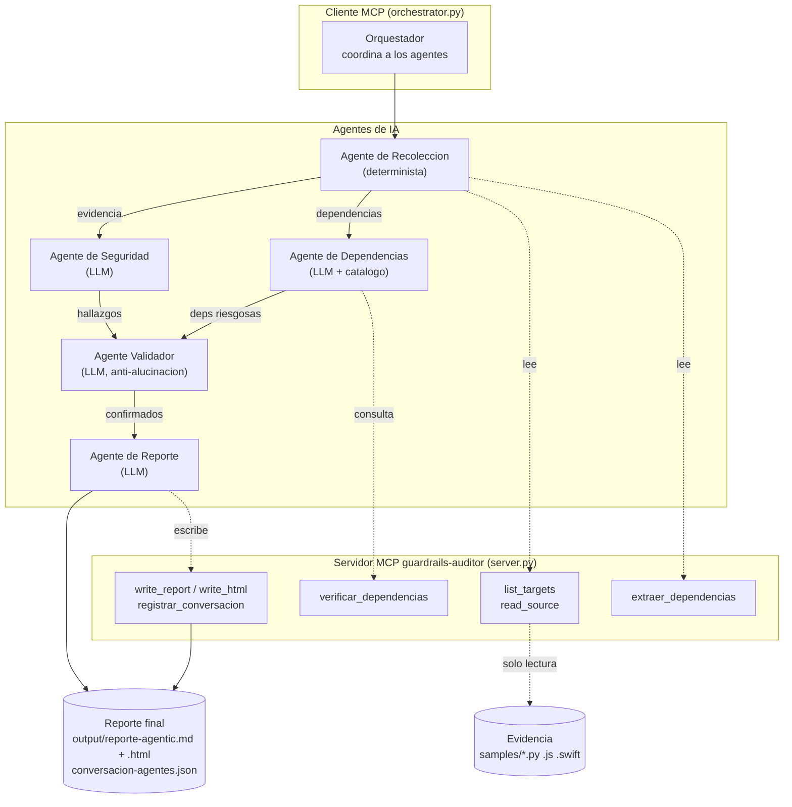

# Arquitectura Agentic - Grupo 3: Guardrails para Vibe Coding (Parte II)

Este documento describe la **mejora agentic** del proyecto: el auditor de un solo
paso evoluciona a un **sistema multi-agente sobre MCP real**, donde varios agentes
de IA conversan, se asignan tareas, validan hallazgos y generan un reporte final.

> La IA no actua como atacante autonomo. Solo **analiza, explica, prioriza y
> recomienda**, siempre con validacion humana. El servidor MCP es el guardrail:
> lee `samples/`, escribe en `output/` y **nunca ejecuta** el codigo auditado.

---

## 1. Diagrama de arquitectura



**Componentes (segun requisito 1 del enunciado):**

| Elemento | En este proyecto |
|----------|------------------|
| Cliente MCP | `src/orchestrator.py` (coordina a los agentes) |
| Servidor MCP | `src/server.py` (`guardrails-auditor`) |
| Herramientas | `list_targets`, `read_source`, `extraer_dependencias`, `verificar_dependencias`, `write_report`, `write_html`, `registrar_conversacion` |
| Agentes | Recoleccion, Seguridad, Dependencias, Validador, Reporte |
| Flujo de comunicacion | Bus `Conversation` con mensajes `AgentMessage` |
| Evidencia | Archivos de codigo generado por IA en `samples/` |
| Reporte final | `output/reporte-agentic.md` + `.html` + `conversacion-agentes.json` |

---

## 2. Los 5 agentes y sus roles

| Agente | Rol | Motor | Tools MCP que usa |
|--------|-----|-------|-------------------|
| **Recoleccion** | Lee el codigo generado por IA y sus dependencias | Determinista | `list_targets`, `read_source`, `extraer_dependencias` |
| **Seguridad** | Interpreta el codigo y genera hallazgos de vulnerabilidades | LLM | (recibe evidencia) |
| **Dependencias** | Revisa librerias riesgosas o inventadas (slopsquatting) | LLM + catalogo | `verificar_dependencias` |
| **Validador** | Confirma si cada hallazgo es real o falso positivo | LLM | (recibe codigo + hallazgos) |
| **Reporte** | Prioriza riesgos y redacta recomendaciones | LLM | `write_report`, `write_html` |

Se cumplen los 4 roles minimos (Recoleccion, Analista=Seguridad, Validador,
Reporte) y se agrega un quinto especializado (Dependencias), tal como sugiere el
enunciado para el Grupo 3.

---

## 3. Comunicacion real entre agentes

Los agentes intercambian mensajes estructurados (`AgentMessage` en
`src/agents.py`). Cada mensaje incluye **exactamente** los campos que pide el
enunciado:

```json
{
  "de": "Agente de Seguridad",
  "para": "Agente Validador",
  "tarea": "Analizar vulnerabilidades en vulnerable_login.py",
  "evidencia": "37 lineas de codigo python (numeradas)",
  "resultado": "6 hallazgos de seguridad detectados",
  "confianza": 0.9,
  "siguiente_accion": "Validar cada hallazgo contra el codigo real",
  "payload": { "...": "datos estructurados del hallazgo" }
}
```

La conversacion completa se persiste en `output/conversacion-agentes.json` y se
resume en la seccion 4 del reporte final. Durante la defensa se muestra esa
tabla como "una conversacion completa entre agentes".

---

## 4. Flujo paso a paso

1. **Recoleccion** llama `list_targets` -> `read_source` -> `extraer_dependencias`
   por cada archivo y emite un mensaje con la evidencia (confianza 100%, determinista).
2. **Seguridad** analiza el codigo numerado y produce hallazgos (CWE, severidad,
   evidencia, reescritura segura).
3. **Dependencias** toma las dependencias declaradas, las cruza con el veredicto
   determinista de `verificar_dependencias` (estandar / conocido / sospechoso /
   desconocido) y razona sobre slopsquatting.
4. **Validador** recibe los hallazgos de Seguridad y Dependencias junto al codigo
   real y marca cada uno como `CONFIRMADO`, `FALSO_POSITIVO` o `REVISION_HUMANA`.
   Es la barrera anti-alucinacion.
5. **Reporte** consolida lo confirmado, prioriza riesgos, redacta recomendaciones
   y declara limitaciones. Persiste el reporte via los tools del servidor.

---

## 5. Herramientas MCP funcionales

| Tool | Tipo | Que hace |
|------|------|----------|
| `list_targets` | inventario | Lista archivos auditables con lenguaje, tamano y hash |
| `read_source` | evidencia | Devuelve el codigo con numeros de linea |
| `extraer_dependencias` | medicion | Extrae imports/requires (ast para Python, regex para JS/TS) |
| `verificar_dependencias` | medicion | Clasifica paquetes contra un catalogo local + heuristica de buzzwords |
| `write_report` | sintesis | Escribe el reporte `.md` (confinado a `output/`) |
| `write_html` | sintesis | Escribe el reporte `.html` (confinado a `output/`) |
| `registrar_conversacion` | trazabilidad | Persiste el intercambio entre agentes en `.json` |

Principio: **los tools miden (deterministas), los agentes razonan (LLM)**.

---

## 6. Uso de Vibe Coding

### Herramienta de IA usada
GitHub Copilot (agente) sobre VS Code, modelo de la familia GPT-5.1 para los agentes.

### Prompts principales
- "Convierte el auditor de un solo paso en un sistema de 5 agentes que conversen
  por un bus de mensajes estructurados sobre el mismo servidor MCP."
- "Cada agente debe ser un rol acotado; los tools deben medir de forma determinista
  y los agentes razonar con el LLM."
- "El Agente Validador debe marcar cada hallazgo como CONFIRMADO / FALSO_POSITIVO /
  REVISION_HUMANA citando la linea, para evitar alucinaciones."
- "Genera un reporte final en Markdown y HTML con las 9 secciones del enunciado,
  incluyendo la conversacion entre agentes."

### Errores encontrados y corregidos por el grupo
- La numeracion de lineas del LLM tenia desfases de +/-1; se documenta como
  limitacion y el Validador se ancla a la evidencia textual, no al numero.
- El LLM tendia a "reparar" el esquema (ej. proponer bcrypt asumiendo datos ya
  migrados); el Agente de Reporte ahora declara dependencias entre fixes como
  limitacion.
- Riesgo de librerias inventadas: se agrego `verificar_dependencias` determinista
  para que el juicio sobre la existencia del paquete no dependa del LLM.

### Decisiones de seguridad agregadas manualmente
- El servidor MCP nunca ejecuta el codigo: solo lo lee y lo mide.
- Acceso a filesystem confinado: lectura en `samples/`, escritura en `output/`,
  con `_safe_resolve` contra path traversal.
- El analisis es 100% defensivo (Blue Team): el prompt prohibe explicar como explotar.
- Validacion humana obligatoria como ultimo paso del flujo.

---

## 7. Como ejecutar el sistema agentic

```bash
export OPENAI_API_KEY="sk-..."
python src/orchestrator.py
```

Salidas generadas en `output/`:
- `reporte-agentic.md` - reporte final con las 9 secciones.
- `reporte-agentic.html` - version visual para la demo.
- `conversacion-agentes.json` - intercambio completo entre agentes.

El flujo clasico de un solo paso (`src/client_demo.py` y la webapp) sigue
funcionando sin cambios.
